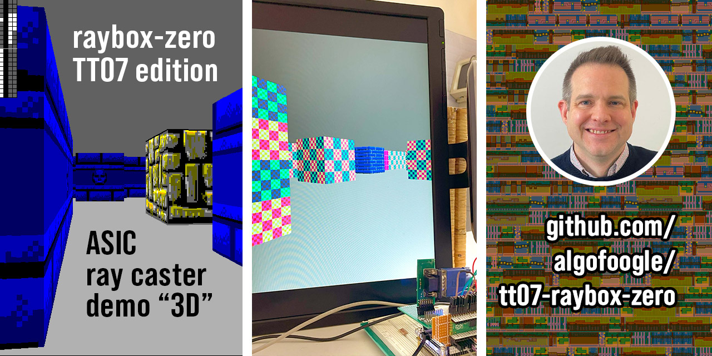
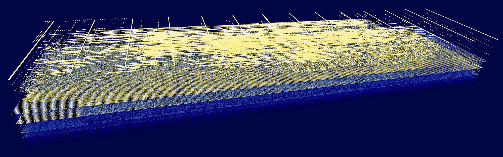

   

# raybox-zero for TT07 (Tiny Tapeout 07) - Resubmission updated from TT04

This is a resubmission of a very simple ray caster demo (sort of like Wolf3D rendering) driving a VGA display without a framebuffer (i.e. by 'racing the beam').

It was originally submitted to TT04, but due to a synthesis bug in the OpenLane flow, it produced severely glitchy output that I didn't discover until the chips came back from fabrication. Had I run a GL (gate-level) sim back in the day, I probably would've caught it, but maybe not had much I could do about it.

The version of OpenLane that TT07 uses doesn't seem to exhibit the same problem; I've since implemented GL sim, and both been able to prove the TT04 bug, and prove that it is gone in this TT07 version. NOTE: Extra special thanks goes to Uri Shaked and Matt Venn of [Tiny Tapeout](https://tinytapeout.com). The opportunity to do this was largely supported by the two of them, who graciously offered a resubmission after the TT04 synthesis bug (from OpenLane) had been observed to cause severe glitches in the rendering (due to an unintended alteration of the logic).

For more information:
- [Read the documentation for this project](docs/info.md) (WIP; [open an issue](https://github.com/algofoogle/tt07-raybox-zero/issues) to tell me what more you want to know)
- See the main source repo for this project: [algofoogle/raybox-zero]
- See [my journal](https://github.com/algofoogle/journal/blob/master/0204-2024-05-25.md) with some details about how I work on this locally.

[algofoogle/raybox-zero]: https://github.com/algofoogle/raybox-zero

## What is Tiny Tapeout?

Tiny Tapeout is an educational project that aims to make it easier and cheaper than ever to get your digital and analog designs manufactured on a real chip.

To learn more and get started, visit https://tinytapeout.com.

## Resources

- [FAQ](https://tinytapeout.com/faq/)
- [Digital design lessons](https://tinytapeout.com/digital_design/)
- [Learn how semiconductors work](https://tinytapeout.com/siliwiz/)
- [Join the community](https://tinytapeout.com/discord)
- [Build your design locally](https://docs.google.com/document/d/1aUUZ1jthRpg4QURIIyzlOaPWlmQzr-jBn3wZipVUPt4)

