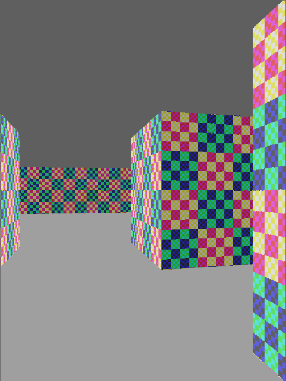

<!---

This file is used to generate your project datasheet. Please fill in the information below and delete any unused
sections.

You can also include images in this folder and reference them in the markdown. Each image must be less than
512 kb in size, and the combined size of all images must be less than 1 MB.
-->

## How it works

This is a framebuffer-less VGA display generator (i.e. it is 'racing the beam') that produces a simple
implementation of a "3D"-like ray casting game engine... just the graphics part of it.
It is inspired by Wolfenstein 3D, using a map that is a grid of wall blocks, with basic texture mapping.

There is nothing yet but textured walls, and flat-coloured floor and ceiling. No doors or sprites, sorry.
Maybe that will come in a future version (stay tuned for TT08, maybe?)

The 'player' POV ("point of view") is controlled by SPI, which can be used to write the player position,
facing X/Y vector, and viewplane X/Y vector in one go.

This design uses 4x2 tiles in the TT04 130nm process. 4 tiles is about 0.16 square millimetres.

NOTE: To optimise the design and make it work without a framebuffer, this renders what is effectively a
portrait view, rotated. A portrait monitor (i.e. one rotated 90 degrees anti-clockwise) will display this
like the conventional first-person shooter view, but it could still be used in a conventional landscape
orientation if you imagine it is for a game where you have a first-person perspective of a flat 2D
platformer, endless runner, "Descent-style" game, whatever.

TBC.

## How to test

TBC.

`debug` can be asserted to show current state of POV (point-of-view) registers, which might come in handy
when trying to debug SPI writes.

If `reg` input is asserted, VGA outputs are registered. Otherwise, they are just as they come out of internal combo logic.
I've done it this way so I can test the difference (if any).

`inc_px` and `inc_py` can be asserted to continuously increment their respective player X/Y position register.
Normally the registers should be updated via SPI, but this allows someone to at least see a demo in action
without having to implement the SPI host controller.

The "SPI2" ports (`reg_sclk`, etc.) are for access to all other registers that we can play with.
I decided to keep these separate because I implemented them very late, and didn't want to break the
existing SPI interface for POV register access.

## External hardware

VGA connector with RGB222 DAC
