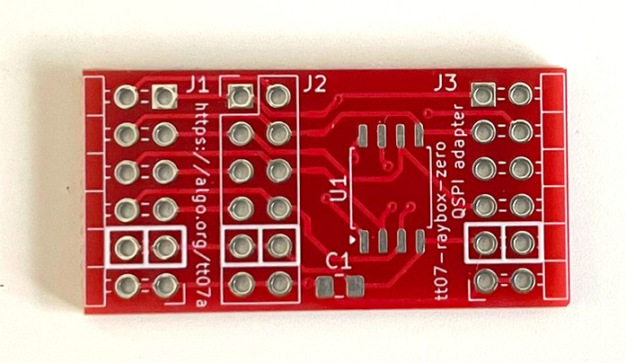
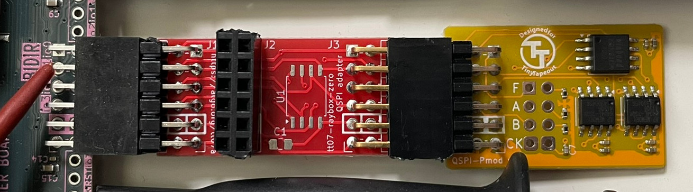

# tt07-raybox-zero PCB(s)

This directory currently contains:

*   [`qspi-pmod-adapter/`](./qspi-pmod-adapter): Kicad PCB layout for a small adapter board that makes the [Tiny QSPI PMOD] work with tt07-raybox-zero. Can also just be used as a QSPI PMOD (if you solder U1 and C1).
*   [`Anton Kicad Footprints Lib.pretty/`](./Anton%20Kicad%20Footprints%20Lib.pretty/): Kicad footprints for PMOD connectors.

# Where to get the latest versions?

Each PCB and each revision I've had made has its own unique URL suffix silkscreened on the board.

For the latest version's files, see: https://github.com/algofoogle/tt07-raybox-zero/tree/main/pcb

Otherwise, see the [PCB revisions below](#pcb-revisions) to compare with the specific revision you have.

# PCB revisions

## `tt07a` QSPI adapter

This version of the board was my first prototype, intended to be demonstrated during the Tiny Tapeout 7 Bring-up Party live stream.

This board has a PMOD plug on only one end that is to remain plugged into the TT07 demo board's "Bidirectional" PMOD socket, and then the [Tiny QSPI PMOD] is meant to be alternated between the vertical slot (J2, for programming) and the edge slot (J3, for use with raybox-zero).

There is a footprint for an optional *on-board* QSPI chip, but it is not wired for being programmed by the [Tiny Tapeout Flasher](https://tinytapeout.github.io/tinytapeout-flasher/) utility, so would need to be wired up manually for programming.

[Commit `4ecdaab`](https://github.com/algofoogle/tt07-raybox-zero/tree/4ecdaabfdce3f8536820e55c5c4c37ef2575f69a/pcb/qspi-pmod-adapter) has the specific Gerber files that were fabricated.

[Tiny QSPI PMOD]: https://github.com/mole99/qspi-pmod
